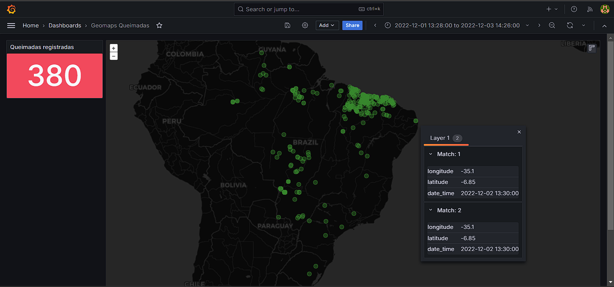
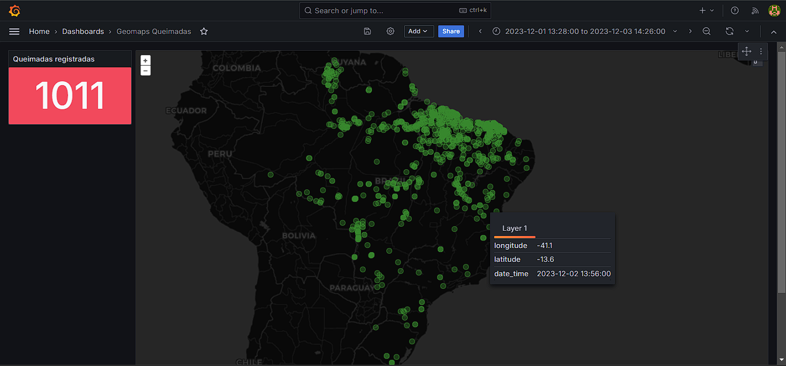
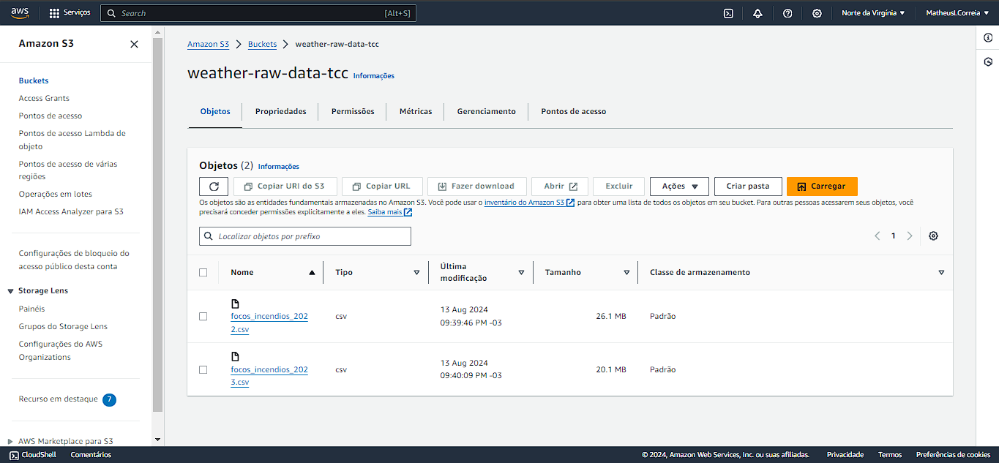

# Weather Changes Project

Fires, temperature and weather data collected from APIs and files

## Dashboar Prototype
Fire Dec 2022

Fire Dec 2023

## AWS Bucket Objects

## Airflow Installation

- yum update -y
- yum install python3.12 -y
- yum install wget
- wget https://bootstrap.pypa.io/get-pip.py
- python3.12 get-pip.py
- export AIRFLOW_HOME=~/airflow
- AIRFLOW_VERSION=2.9.3
- PYTHON_VERSION="$(python3.12 -c 'import sys; print(f"{sys.version_info.major}.{sys.version_info.minor}")')"
- CONSTRAINT_URL="https://raw.githubusercontent.com/apache/airflow/constraints-${AIRFLOW_VERSION}/constraints-${PYTHON_VERSION}.txt"
- python3.12 pip install "apache-airflow==${AIRFLOW_VERSION}" --constraint "${CONSTRAINT_URL}"

## Processes
- https://tecadmin.net/convert-ppk-to-pem-using-command/#google_vignette
- 